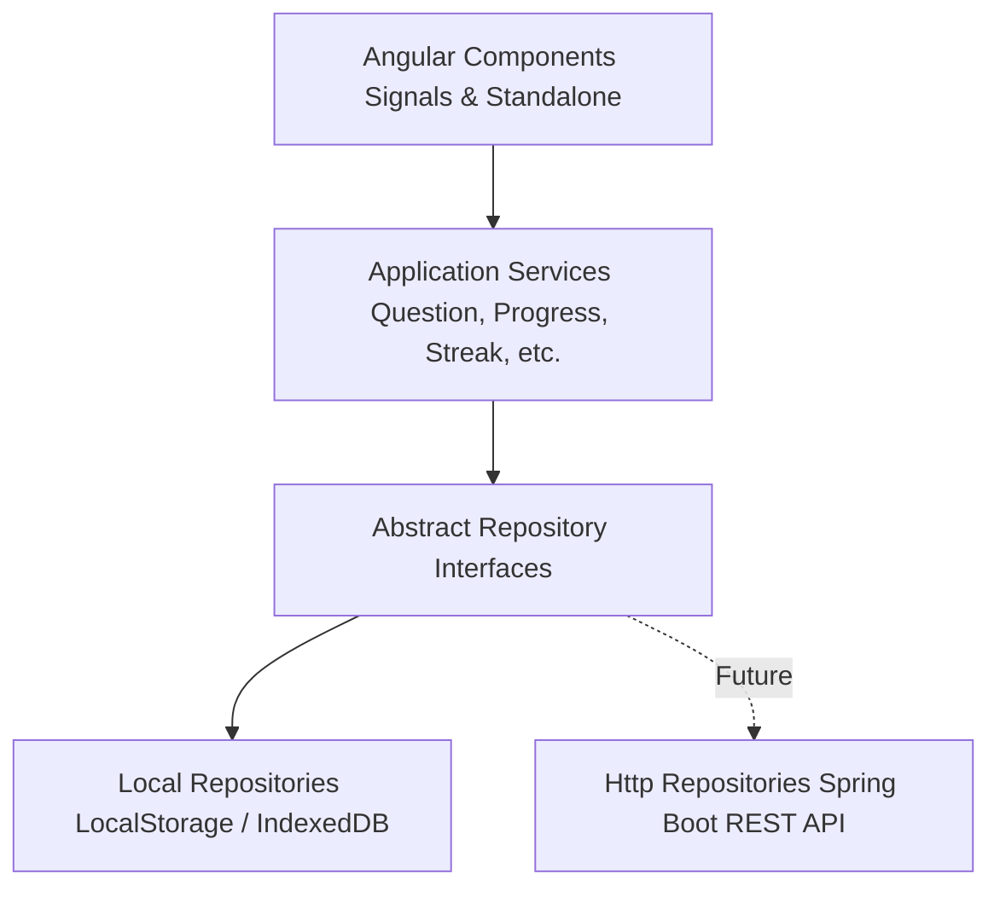

# DSA Tracker Architecture

## Overview
The DSA Question Tracker Angular application is designed with a **clean, backend-agnostic architecture** using the **Repository Pattern**.

## Core Layers

1. **Domain Layer (`src/app/core/models/`)**
   - Strongly typed TypeScript interfaces representing core domain entities (`Question`, `QuestionProgress`, `UserActivity`, `DailyGoal`, `AppSettings`, `User`).

2. **Repository Layer (`src/app/core/repositories/`)**
   - Abstract repository contracts (`ProgressRepository`, `NotesRepository`, `ActivityRepository`, `SettingsRepository`, `AuthRepository`).
   - Decouples UI & business logic from storage mechanisms.
   - `Local*Repository` implementations store data in `LocalStorage`.
   - When Spring Boot API is ready, create `Http*Repository` and swap in Angular's DI container.

3. **Service Layer (`src/app/core/services/`)**
   - Encapsulates business logic, algorithms (Smart Revision, Readiness Score, Streaks), and state.
   - Uses **Angular Signals** (`signal()`, `computed()`) for ultra-responsive reactivity.

4. **Component Layer (`src/app/features/`, `src/app/layout/`)**
   - Pure standalone Angular components.
   - Layout: Sidebar nav (desktop) + top header & bottom nav (mobile).
   - Reactive UI binding to Signals.
